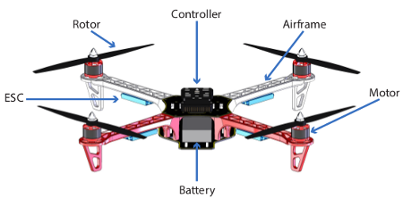

# Unmanned Aerial Vehicle Swarm

## Overview
The Unmanned Aerial Vehicle (UAV) Swarm pilot study is concerned with a collection of UAVs that communicate in order to achieve some global behaviour.

Each UAV is able to adjust its pitch, yaw and roll to move in 3D space using rotors. Each UAV has a controller which is able to communicate with its environment. In a swarm, the UAVs may cooperate in order to avoid collide, to achieve some predefined topology, or collaborate to provide some functionality. In this study, we demonstrate the use of a central controller to dictate the desired movements of the UAVs comprising the swarm.

## Supported Features
This study supports the following INTO-CPS technologies:

* Multi-DE model
* Multi-CT model
* 20-Sim (for FMU)
* VDM-RT (for FMU)
* INTO-CPS SysML  
* Co-simulation Engine (COE)
* Test Automation
* Model Checking

## Additional Information
Additional Information about this case study can be found in the [Examples Compendium](http://projects.au.dk/fileadmin/D3.5_Examples_Compendium_2.pdf#page=57)

Alternatively, contact the case study owner, [Casper Thule](mailto:casper.thule@eng.au.dk).
